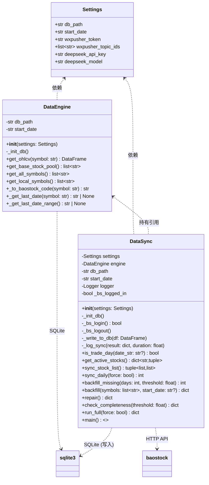
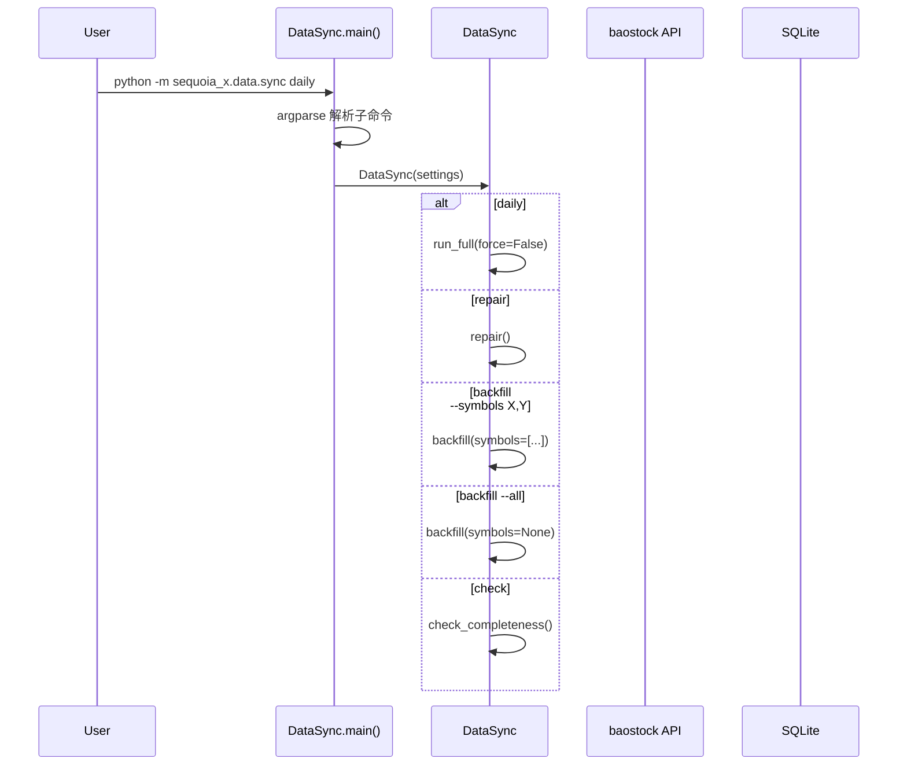
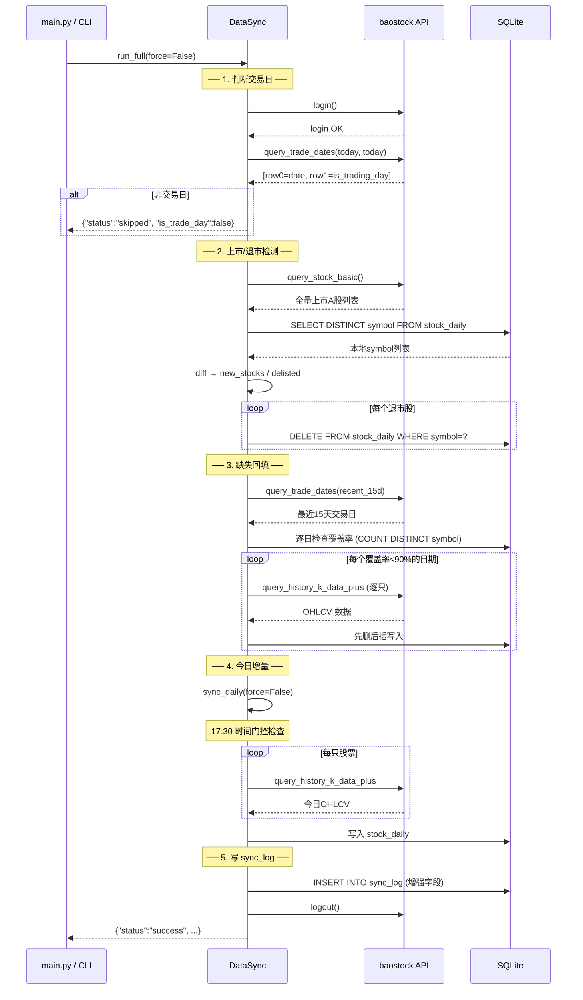
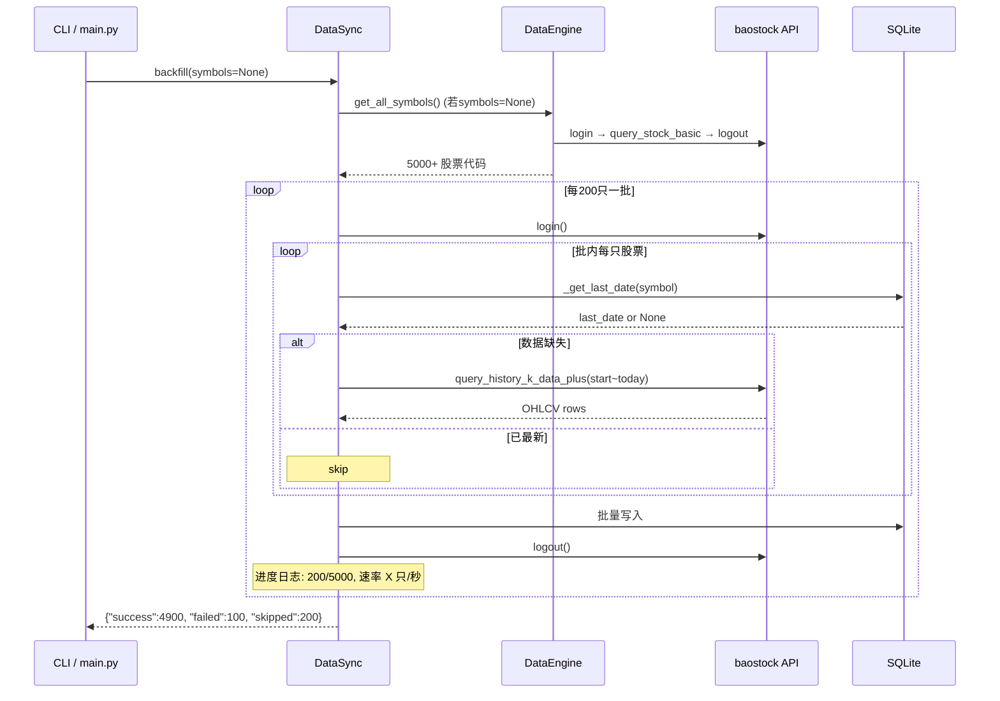
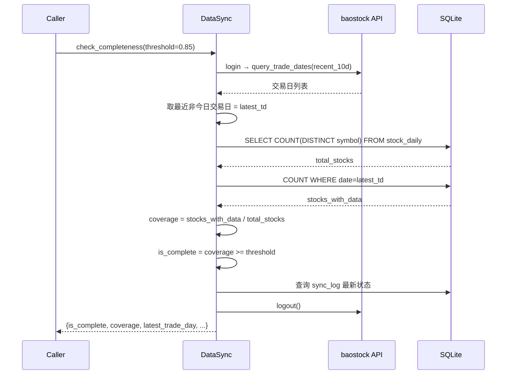
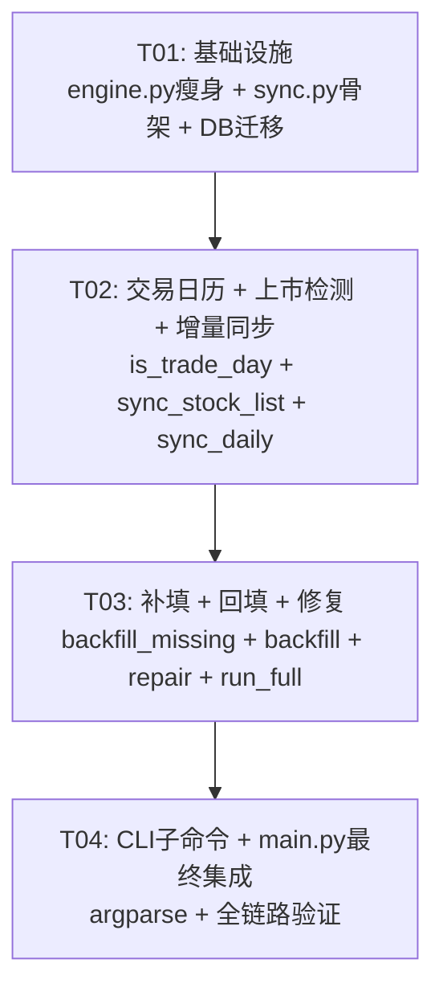

# 系统架构设计：Sequoia-X 数据同步模块独立化

> **Architect**: Bob  
> **基于 PRD**: `prd_sync_module.md` v1.0 (Alice)  
> **日期**: 2025-01-20

---

## Part A：系统设计

### 1. 实现方案

#### 1.1 核心挑战

| 挑战 | 分析 |
|------|------|
| **关注点分离** | 当前 `DataEngine` 同时承担查询和同步职责（约 800 行），维护困难。需将 6 个同步方法独立为 `DataSync` 类。 |
| **baostock 单连接限制** | baostock 的 `SocketUtil` 是单例模式，多次 `login()`/`logout()` 会导致连接冲突。需在会话级复用连接。 |
| **Bug 修复** | `sync_today_bulk` 存在 `last_local_date` 作用域 Bug（17:30 后的 else 分支引用了未定义变量）。`sync_and_clean` 中存在 3 次不必要的 login/logout。 |
| **交易日判断** | 当前使用 `query_trade_dates` 仅用于回看，未在同步入口处判断"今日是否为交易日"——非交易日时会空跑 API。 |
| **上市/退市检测** | 当前 30 日间隔检查方案可能遗漏近期上市/退市股票。改用 `query_stock_basic` 实时对比。 |

#### 1.2 框架 & 库选型

| 组件 | 选择 | 理由 |
|------|------|------|
| **HTTP 数据源** | `baostock` (现有) | 免费、稳定、覆盖全量 A 股日线，无需替换 |
| **数据库** | `sqlite3` (标准库, 现有) | 单文件、零配置、足够支撑百万级行情数据 |
| **数据处理** | `pandas` (现有) | 批量写入 `to_sql` 高效，清洗管道成熟 |
| **配置管理** | `pydantic-settings` (现有，`Settings` 类) | 已有 `db_path`、`start_date` 等配置，无需新增依赖 |
| **日志** | `rich` + `logging` (现有) | 结构化彩色日志，终端友好 |
| **CLI** | `argparse` (标准库) | `python -m sequoia_x.data.sync <subcommand>` 模式，零额外依赖 |

**无新增第三方依赖**。所有功能均基于现有 `requirements.txt` 即可实现。

#### 1.3 架构模式

采用 **单一职责 + 委托模式**：

```
main.py / CLI
    │
    ├── DataEngine (查询层：只读)
    │   └── get_ohlcv / get_base_stock_pool / get_all_symbols / get_local_symbols
    │
    └── DataSync (同步层：读写)
        ├── 内部持有 DataEngine 实例（复用查询能力）
        ├── 管理 baostock 连接生命周期（单会话复用）
        └── 写入 SQLite + sync_log
```

关键设计决策：

1. **DataSync 持有 DataEngine**：避免 DB 连接代码重复，`DataSync` 通过 `self.engine.get_local_symbols()` 等方法复用查询。
2. **连接池策略**：`DataSync` 维护一个 `_bs_logged_in: bool` 标志，`run_full()` 开头 login 一次、结尾 logout 一次。长任务（`backfill`）每 200 只 reconnect。
3. **`get_trade_calendar` 迁入 DataSync**：该方法仅供同步过程使用，不属于查询 API。`DataEngine` 中删除。

---

### 2. 文件列表

```
sequoia_x/
├── core/
│   └── config.py          # [不改动] 已有 db_path / start_date
├── data/
│   ├── __init__.py         # [修改] 更新模块文档
│   ├── engine.py           # [修改] 删除 6+1 个同步方法，保留查询方法
│   └── sync.py             # [新建] DataSync 类 ← 核心交付物
├── main.py                 # [修改] 适配 DataSync，删除对 engine 同步方法的引用
└── tests/                  # (可选，不在本次范围)
    └── test_sync.py        # [可选] 同步模块单元测试
```

**文件变更汇总**：

| 文件 | 操作 | 说明 |
|------|------|------|
| `sequoia_x/data/sync.py` | **新建** | `DataSync` 完整实现（~500 行） |
| `sequoia_x/data/engine.py` | **修改** | 删除 7 个方法，升级 `sync_log` 建表 SQL |
| `sequoia_x/data/__init__.py` | **修改** | 更新模块 docstring |
| `main.py` | **修改** | 所有同步调用改为 `DataSync` |

---

### 3. 数据结构和接口

#### 3.1 类图



#### 3.2 DataSync 完整方法签名

```python
class DataSync:
    """数据同步模块，负责 baostock → SQLite 的全量/增量数据同步。"""

    # ── 构造 ──
    def __init__(self, settings: Settings) -> None:
        """
        Args:
            settings: 系统配置对象（需含 db_path, start_date）。
        """

    # ── 内部辅助 ──
    def _init_db(self) -> None:
        """初始化数据库表结构（stock_daily + 增强版 sync_log）。"""

    def _bs_login(self) -> bool:
        """登录 baostock，设置 _bs_logged_in = True。返回成功标志。"""

    def _bs_logout(self) -> None:
        """登出 baostock（若已登录）。"""

    def _write_to_db(self, df: pd.DataFrame) -> int:
        """将 DataFrame 写入 stock_daily（先删后插策略）。返回写入行数。"""

    def _log_sync(self, result: dict, duration: float) -> None:
        """将同步结果写入增强版 sync_log 表。"""

    # ── 交易日历 ──
    def is_trade_day(self, date_str: str | None = None) -> bool:
        """
        判断指定日期是否为 baostock 交易日。
        Args:
            date_str: 日期字符串 YYYY-MM-DD，默认今日。
        Returns:
            True 表示交易日。
        """

    # ── 上市/退市检测 ──
    def get_active_stocks(self) -> dict[str, tuple[str, str]]:
        """
        调用 bs.query_stock_basic 获取当前上市 A 股。
        Returns:
            {code_num: (name, ipo_date)}，如 {"600000": ("浦发银行", "1999-11-10")}。
        """

    def sync_stock_list(self) -> tuple[list[str], list[str]]:
        """
        对比 baostock 活跃列表与本地 stock_daily，处理上市/退市。
        Returns:
            (new_stocks, delisted_stocks) — 新股代码列表、退市股代码列表。
        Side effects: 从 stock_daily 删除退市股数据。
        """

    # ── 增量同步 ──
    def sync_daily(self, force: bool = False) -> int:
        """
        单进程顺序拉取今日增量日线（后复权）。
        Bug 修复: last_local_date 作用域问题已修复。
        连接复用: 不独立 login/logout，使用调用方的连接。
        时间门控: 若未到 17:30 且本地覆盖率 > 80%，跳过。
        Args:
            force: True 跳过时间门控，强制拉取。
        Returns:
            写入的行情记录条数。
        """

    # ── 缺失补填 ──
    def backfill_missing(
        self, days: int = 15, threshold: float = 0.9
    ) -> int:
        """
        检测最近 N 个交易日中覆盖率 < threshold 的日期，逐日回填。
        Returns:
            成功补填的交易日天数。
        """

    # ── 历史回填 ──
    def backfill(
        self, symbols: list[str] | None = None, start_date: str | None = None
    ) -> dict:
        """
        单进程顺序回填历史 K 线。支持续传（已有数据自动跳过）。
        每 200 只重连一次。
        Args:
            symbols: 股票代码列表，None 表示全市场（调用 get_all_symbols）。
            start_date: 回填起始日期，None 使用 settings.start_date。
        Returns:
            {"success": int, "failed": int, "skipped": int, "elapsed": float}
        """

    # ── 一键修复 ──
    def repair(self) -> dict:
        """
        一键修复管线：退市清理 → 新股发现 → 缺失回填 → 增量拉取。
        无时间门控，force=True 模式。
        Returns:
            {"status": str, "before": str, "after": str,
             "delisted": int, "new_listed": int, "backfilled": int, "error": str}
        """

    # ── 完整性检查 ──
    def check_completeness(self, threshold: float = 0.85) -> dict:
        """
        检查最近交易日数据覆盖率。
        Args:
            threshold: 覆盖率阈值，默认 0.85（85%）。
        Returns:
            {"is_complete": bool, "latest_trade_day": str,
             "coverage": float, "total_stocks": int,
             "stocks_with_data": int, "last_sync_status": str}
        """

    # ── 完整管线（主入口） ──
    def run_full(self, force: bool = False) -> dict:
        """
        完整同步管线（替代旧 sync_and_clean）：
        1. 交易日判断（非交易日跳过）
        2. 上市/退市检测
        3. 缺失回填（最近 15 天，阈值 90%）
        4. 今日增量
        5. 写 sync_log
        一次会话只 login/logout 一次。
        Args:
            force: 是否强制（跳过时间门控）。
        Returns:
            {"status": str, "stock_count": int, "delisted": int,
             "new_listed": int, "backfilled": int, "latest_date": str,
             "is_trade_day": bool, "coverage": float, "error": str}
        """

    # ── CLI ──
    @staticmethod
    def main() -> None:
        """argparse CLI 入口。支持 daily / repair / backfill / check 子命令。"""
```

#### 3.3 `sync_log` 表增强后结构

```sql
CREATE TABLE IF NOT EXISTS sync_log (
    id                INTEGER PRIMARY KEY AUTOINCREMENT,
    date              TEXT    NOT NULL UNIQUE,
    status            TEXT    NOT NULL,          -- 'success' | 'failed' | 'skipped'
    stock_count       INTEGER DEFAULT 0,
    delisted_count    INTEGER DEFAULT 0,
    new_listed_count  INTEGER DEFAULT 0,
    backfilled_days   INTEGER DEFAULT 0,
    is_trade_day      INTEGER DEFAULT 1,        -- [新增] 0=非交易日
    api_status        TEXT    DEFAULT '',        -- [新增] baostock 连接状态
    coverage          REAL    DEFAULT 0.0,       -- [新增] 最新日覆盖率
    duration_seconds  REAL    DEFAULT 0.0,       -- [新增] 同步耗时
    error_msg         TEXT,
    created_at        TEXT    DEFAULT (datetime('now','localtime'))
);
```

**迁移策略**：在 `DataSync._init_db()` 中使用 `ALTER TABLE ... ADD COLUMN IF NOT EXISTS` 模式（SQLite 3.35+ 支持）或 try-except 捕获重复列错误。

---

### 4. 程序调用流程

#### 4.1 CLI 分发流程



#### 4.2 `run_full()` 完整管线（核心流程）



#### 4.3 `backfill()` 回填流程



#### 4.4 `check_completeness()` 流程



---

### 5. 待明确事项

| # | 问题 | 当前假设 | 影响 |
|---|------|----------|------|
| Q1 | `get_trade_calendar` 是否在 `DataEngine` 中保留一份？ | **不保留**。迁入 `DataSync`，它是同步专用方法。若未来查询场景需要，可再加回。 | engine.py 删除 7 个方法而非 6 个 |
| Q2 | `get_all_symbols` / `get_local_symbols` 是否需要包含指数？ | **包含指数**但 `sync_stock_list` 不过滤指数（维持现有行为）。`check_completeness` 统计时包含全部 symbol。 | 覆盖率统计口径 |
| Q3 | 旧脚本 CSV 输出功能？ | **不保留**。SQLite 为唯一数据源，CSV 由上层按需实现。 | 无 |
| Q4 | 6 个指数的同步策略？ | **作为可选配置项**。当前默认同步全部 `query_stock_basic` 返回的 A 股（含指数）。在 `_write_to_db` 中不做过滤。 | 数据量略增 |
| Q5 | `backfill --start-date` 参数？ | **支持**。`DataSync.backfill(start_date=...)` 覆盖 `Settings.start_date`。CLI 中暴露 `--start-date` 选项。 | 增加回填灵活性 |
| Q6 | `check_completeness` 覆盖率阈值？ | **默认 85%，可配置**。`DataSync.check_completeness(threshold=0.85)`。 | 运维灵活性 |

---

## Part B：任务分解

### 6. 所需依赖包

```
# 无新增第三方依赖。现有依赖已满足所有需求：
- baostock          # A 股行情数据源
- pandas>=2.0       # 数据处理 & SQLite 写入
- pydantic-settings # 配置管理
- rich              # 终端日志
- python-dotenv     # .env 加载
```

### 7. 任务列表（按依赖排序）

---

#### T01: 基础设施层 — engine.py 瘦身 + sync.py 骨架

| 字段 | 内容 |
|------|------|
| **Task ID** | T01 |
| **任务名** | 基础设施：engine.py 瘦身 + sync.py 骨架 + DB 迁移 |
| **源文件** | `sequoia_x/data/engine.py`（删除 7 个同步方法 + 升级建表 SQL）、`sequoia_x/data/sync.py`（新建：DataSync 类骨架 + `__init__` + `_init_db` + 辅助方法）、`sequoia_x/data/__init__.py`（更新模块文档） |
| **依赖** | 无 |
| **优先级** | P0 |

**详细工作项**：

1. **`engine.py` 修改**：
   - 删除以下方法及其完整实现：`sync_and_clean()`, `sync_today_bulk()`, `repair_data()`, `backfill()`, `check_data_completeness()`, `get_trade_calendar()`
   - 保留：`__init__`, `_init_db`, `get_ohlcv`, `get_base_stock_pool`, `get_all_symbols`, `get_local_symbols`, `_to_baostock_code`, `_get_last_date`, `_get_last_date_range`
   - 升级 `_CREATE_SYNC_LOG_SQL` 常量：新增 `is_trade_day INTEGER DEFAULT 1`, `api_status TEXT DEFAULT ''`, `coverage REAL DEFAULT 0.0`, `duration_seconds REAL DEFAULT 0.0`
   - 在 `_init_db()` 中添加迁移逻辑：用 try-except 对已有 `sync_log` 表执行 `ALTER TABLE ADD COLUMN`

2. **`sync.py` 新建**：
   - 创建 `DataSync` 类骨架
   - 实现 `__init__(self, settings: Settings)`：初始化 `self.engine = DataEngine(settings)`、`self._bs_logged_in = False`
   - 实现 `_init_db(self)`：调用 `self.engine._init_db()`，补充 sync_log 增强字段迁移
   - 实现 `_bs_login(self) -> bool` / `_bs_logout(self)`
   - 实现 `_write_to_db(self, df: pd.DataFrame) -> int`：从 `sync_today_bulk` 末尾提取的通用写入逻辑（先删后插 + 类型转换 + 去空）
   - 实现 `_log_sync(self, result: dict, duration: float)`：写入增强版 sync_log

3. **`__init__.py` 修改**：更新模块 docstring，反映 `DataEngine`（查询）+ `DataSync`（同步）双模块结构。

---

#### T02: 交易日历 + 上市检测 + 增量同步

| 字段 | 内容 |
|------|------|
| **Task ID** | T02 |
| **任务名** | 交易日历 + 上市/退市实时检测 + 增量日线同步（修复 Bug） |
| **源文件** | `sequoia_x/data/sync.py`（实现 `is_trade_day`, `get_active_stocks`, `sync_stock_list`, `sync_daily`）、`sequoia_x/data/engine.py`（确认保留方法签名兼容）、`main.py`（临时适配：backfill 调用改为 DataSync） |
| **依赖** | T01 |
| **优先级** | P0 |

**详细工作项**：

1. **`is_trade_day(date_str)`**：
   - 调用 `bs.query_trade_dates(start_date=date_str, end_date=date_str)`
   - 检查返回行 `row[1] == "1"` 表示交易日
   - 复用 `_bs_login` / `_bs_logout`（不额外 login/logout）

2. **`get_active_stocks()`**：
   - 调用 `bs.query_stock_basic(code_name="", code="")`
   - 过滤 `status=="1" and s_type=="1"`（上市股票）
   - 返回 `{code_num: (name, ipo_date)}`

3. **`sync_stock_list()`**：
   - 对比 `get_active_stocks()` 与 `self.engine.get_local_symbols()`
   - 退市股 → `DELETE FROM stock_daily`
   - 返回 `(new_stocks, delisted_stocks)`

4. **`sync_daily(force)`** — 移植自 `sync_today_bulk`，修复两个 Bug：
   - **Bug 1 修复**（`last_local_date` 作用域）：将 `last_local_date = self.engine._get_last_date_range()` 移至 `if not force:` 块的最开头（在时间门控判断之前），确保后续 else 分支也能引用。
   - **Bug 2 修复**（连接复用）：不再内部 `bs.login()`/`bs.logout()`，改为检查 `self._bs_logged_in` 并复用调用方的连接。
   - 保持每 1000 只进度日志、50ms 间隔等细节。

5. **`main.py` 临时适配**：
   - 在 `--backfill` 分支中，改为 `DataSync(settings).backfill(symbols=None if --all else [...])`
   - 确保可独立验证 T02 产出。

---

#### T03: 缺失补填 + 历史回填 + 一键修复

| 字段 | 内容 |
|------|------|
| **Task ID** | T03 |
| **任务名** | 缺失补填 + 历史回填 + 一键修复管线 |
| **源文件** | `sequoia_x/data/sync.py`（实现 `backfill_missing`, `backfill`, `repair`, `run_full`）、`main.py`（适配 `--repair` 和 `--sync-only` 模式）、`sequoia_x/data/engine.py`（确认无遗留引用） |
| **依赖** | T02 |
| **优先级** | P0 |

**详细工作项**：

1. **`backfill_missing(days=15, threshold=0.9)`**：
   - 从 `sync_and_clean` 步骤 4 移植
   - 获取最近 `days` 天交易日历
   - 逐日检查覆盖率（`COUNT DISTINCT symbol WHERE date=?`）
   - 覆盖率 < threshold 的日期 → 逐只拉取回填
   - **连接复用**：在整个回填过程中使用同一连接（不逐日 login/logout），每 200 只 reconnect
   - 返回成功补填天数

2. **`backfill(symbols=None, start_date=None)`**：
   - 从 `DataEngine.backfill` 移植
   - `symbols=None` 时自动调用 `self.engine.get_all_symbols()`
   - `start_date=None` 时使用 `self.settings.start_date`，CLI `--start-date` 可覆盖
   - 保持每 200 只 reconnect 策略 + 续传逻辑
   - 返回 `{"success": int, "failed": int, "skipped": int, "elapsed": float}`

3. **`repair()`**：
   - 从 `DataEngine.repair_data` 移植
   - 内部调用 `run_full(force=True)` 实现完整修复
   - 增加修复前后状态展示

4. **`run_full(force=False)`** — 完整管线：
   - 替代旧 `sync_and_clean`，整合 T01-T03 所有方法
   - 管线：`is_trade_day` → `sync_stock_list` → `backfill_missing` → `sync_daily` → `_log_sync`
   - **连接复用**：一次 `_bs_login()` 贯穿全流程，最后 `_bs_logout()`
   - 非交易日提前返回 `{"status": "skipped", "is_trade_day": false}`

5. **`main.py` 适配**：
   - `--sync-only` → `DataSync(settings).run_full()`
   - `--repair` → `DataSync(settings).repair()`

---

#### T04: CLI 子命令 + main.py 最终集成

| 字段 | 内容 |
|------|------|
| **Task ID** | T04 |
| **任务名** | CLI 子命令入口 + main.py 最终适配 + 全链路验证 |
| **源文件** | `sequoia_x/data/sync.py`（实现 `DataSync.main()` CLI 入口）、`main.py`（最终版：删除所有对 engine 同步方法的引用，统一使用 DataSync）、`sequoia_x/data/__init__.py`（最终导出确认） |
| **依赖** | T03 |
| **优先级** | P1 |

**详细工作项**：

1. **`DataSync.main()` — CLI 入口**：
   ```python
   @staticmethod
   def main():
       parser = argparse.ArgumentParser(description="Sequoia-X 数据同步模块")
       sub = parser.add_subparsers(dest="command", required=True)
       
       sub.add_parser("daily", help="每日增量同步")
       sub.add_parser("repair", help="一键修复")
       
       bf = sub.add_parser("backfill", help="历史回填")
       bf.add_argument("--symbols", help="股票代码，逗号分隔")
       bf.add_argument("--all", action="store_true", help="全市场")
       bf.add_argument("--start-date", help="起始日期 YYYY-MM-DD")
       
       sub.add_parser("check", help="数据完整性检查")
       
       args = parser.parse_args()
       settings = get_settings()
       ds = DataSync(settings)
       
       if args.command == "daily":
           ds.run_full()
       elif args.command == "repair":
           ds.repair()
       elif args.command == "backfill":
           symbols = args.symbols.split(",") if args.symbols else (None if args.all else [])
           ds.backfill(symbols=symbols, start_date=getattr(args, "start_date", None))
       elif args.command == "check":
           ds.check_completeness()
   ```

2. **`main.py` 最终适配**：
   - `--backfill` 分支：改为 `DataSync(settings).backfill(...)`，移除对 `engine.get_all_symbols()` 的直接调用
   - `--repair` 分支：改为 `DataSync(settings).repair()`
   - `--sync-only` 分支：改为 `DataSync(settings).run_full()`
   - `check_data_completeness` 调用：改为 `DataSync(settings).check_completeness()`
   - **保留不变**：策略选股、LLM 分析、推送逻辑

3. **`__init__.py` 最终更新**：确认模块结构文档准确。

4. **全链路验证清单**：
   - [ ] `python -m sequoia_x.data.sync daily`（交易日/非交易日各一次）
   - [ ] `python -m sequoia_x.data.sync repair`
   - [ ] `python -m sequoia_x.data.sync backfill --symbols sh.600000`
   - [ ] `python -m sequoia_x.data.sync backfill --all --start-date 2025-01-01`
   - [ ] `python -m sequoia_x.data.sync check`
   - [ ] `python main.py --sync-only`（19:10 模式）
   - [ ] `python main.py --repair`
   - [ ] `python main.py --backfill`
   - [ ] `python main.py`（日常模式，20:55 选股）

---

### 8. 共享知识

以下约定在 `engine.py`、`sync.py`、`main.py` 之间共享：

```yaml
# ── 数据库约定 ──
日期格式: "YYYY-MM-DD" (所有 date 字段统一)
stock_daily.volume: 成交量（股），过滤条件 volume > 0
stock_daily.turnover: 成交额（元），来源 baostock "amount" 字段 → 写入时 rename
数据写入策略: "先删后插" — 对每个涉及的 date 执行 DELETE 再 INSERT（保证幂等性）

# ── baostock 约定 ──
代码格式:
  内部: 纯数字 "600000"
  baostock: "sh.600000" / "sz.000001"（通过 _to_baostock_code 转换）
日线入库时间: 17:30 CST（此为门控判断依据）
请求间隔: 50ms（增量）/ 200ms（回填，已在 backfill 方法中使用）
重连间隔: 200 只股票（backfill 模式）
请求参数:
  frequency="d", adjustflag="1"（后复权）
  fields: "date,open,high,low,close,volume,amount"

# ── 覆盖率约定 ──
增量同步时间门控: 本地覆盖率 > 80% 时跳过（17:30 前）
缺失补填阈值: 覆盖率 < 90% 触发回填
完整性检查阈值: 默认 85%（可配置），≥ 此值视为完整

# ── 日志约定 ──
logger = get_logger(__name__)  # 标准获取方式
进度日志频率: 每 1000 只（增量）、每 200 只（回填）
关键节点: 交易日判断 / API登录状态 / 退市数 / 新股数 / 耗时

# ── 错误处理约定 ──
单只股票失败: 不中断其他股票处理，记录错误日志
baostock 登录失败: 返回空结果/错误状态，不抛异常
sync_log 写入失败: warning 级别日志，不抛异常
数据库写入: 使用 with sqlite3.connect(...) 保证连接关闭

# ── 返回格式约定 ──
run_full / repair: {"status": "success"|"failed"|"skipped", ...}
backfill: {"success": int, "failed": int, "skipped": int, "elapsed": float}
check_completeness: {"is_complete": bool, "coverage": float, ...}
sync_daily: 返回 int (写入行数)
```

---

### 9. 任务依赖图



**并行可能性**：T02 和 T03 之间有严格依赖（T03 的 `run_full` 调用 T02 的方法），必须顺序执行。T04 依赖 T03 完成。

---

*文档版本: v1.0 | 架构师: Bob | 基于 PRD v1.0 (Alice)*
